<div class="jsdoc-hidden">


</div>

# JSDoc VisionTheme

JSDoc VisionTheme is a modern, clean, fully responsive, and highly customizable theme for JSDoc, designed to bring documentation for modern JavaScript projects to the next level.

Developed by [alphanull](https://alphanull.de) with a focus on large-scale ES2022+ codebases, VisionTheme offers a fresh, user-friendly approach to documentation. It emphasizes clarity, accessibility, and flexibility — making it easy to create beautiful, maintainable docs that fit your project's branding and developer experience.

**Pro Tip:** Use the [JSDoc ESNext Plugin](https://github.com/alphanull/jsdoc-plugin-esnext) as the perfect companion to this theme for documenting modern ES2022 syntax. This plugin supports automatic documentation of native private fields and more. Give it a try!

## Features

- **Modern Design** – Optimized for readability, performance, and code aesthetics.
- **Optimized Layout** – The original layout has been reworked to remove visual noise and to reorganize sections for maximum clarity.
- **Enhanced Navigation** – Uses accessible dropdown menus, side bar with TOC and smooth scrolling for enhanced navigation.
- **Fully Responsive** – Perfect display on desktop, tablet, and mobile. Includes a mobile menu and responsive table layout.
- **Dark & Light Mode** – Automatic via system settings or manual toggle.
- **Skins & Color Themes** – Instantly switch between 10 different built-in skins or add your own. All skins are HSL-driven; create a wide range of color variations with minimal effort.
- **Advanced Typography System** – Choose from 5 carefully curated font packages: Fira Sans + Code , Ubuntu Sans + Mono, Source Sans 3 + Code Pro, Recursive (Variable) and Noto Sans + Mono. Fira and Recursive support ligatures for enhanced code readability. Font size and family are configurable via the settings panel.
- **Branding Options** – Supports dual logos (light/dark), custom footer HTML, favicon support, and full theming via CSS variables, custom CSS and JS files.
- **Code Highlighting** – Uses highlight.js for syntax highlighting in almost 200 languages with auto-detection. Also supports jump-to-line for easy code referencing.
- **Copy Code** – Every code block features a copy button for instant code copying.
- **Smart Search** – Fast, fuzzy search with highlighted matches using the auto-generated index.
- **Main Dropdown Navigation** – Multi-level dropdown menu with touch and accessibility support.
- **Sidebar Navigation** – TOC navigation with visibility toggle. Generated at build time; no extra plugins or client code needed.
- **Collapse/Expand all** – Instantly collapse or expand all sections (with persistent state).
- **Advanced Markdown support** – Extended Markdown features, code blocks, lists, and tables.
- **Show Privates** – Toggle the display of private members and methods (with persistent state).
- **Advanced Linking** – Automatic linking between tutorials and the start page.
- **Advanced Image Import** – Local images in tutorial markdown or the README are automatically linked and copied to the output.
- **Accessibility** – ARIA roles, accessible controls, navigation, and foldable containers.
- **SEO-friendly** – Automatically generated meta descriptions - even for source code and tutorial pages, as well as support for generating canonical links
- **Persistent Settings** – Settings popup for all client-side user settings (theme, skin, sidebar state, collapse, show privates, etc.), saved in LocalStorage and auto-restored on page load.
- **Ordering & Sorting** – List modules and members either sorted or in the order defined in the source (`"sort": false`).
- **Print CSS** – Docs are fully printable (or exportable to PDF) with dedicated print styles.
- **Compatible** – Tested with JSDoc 3.6.11 and 4.0.4

## Demo

To see this theme in action, visit the [VisionPlayer Documentation](https://visionplayer.io/docs) page, which showcases a complex, real-world example. This includes the README.md and all additional guides from the GitHub repo, unmodified, using the advanced tutorial features.

## Screenshots

Taken from the online demo:

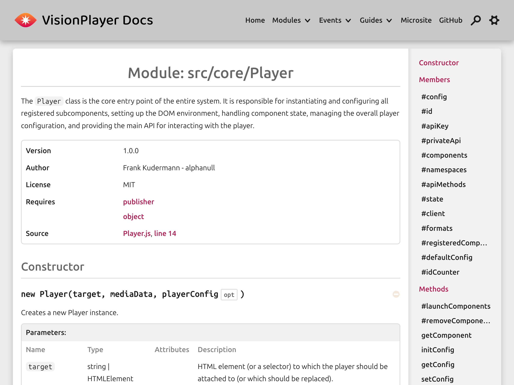

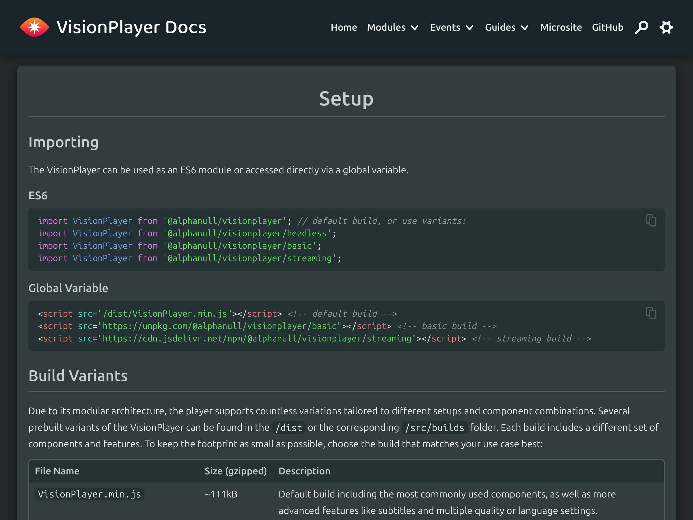

| 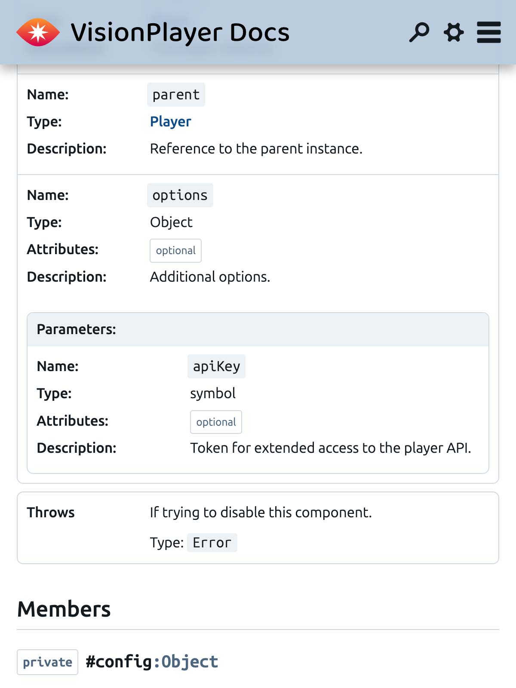 | 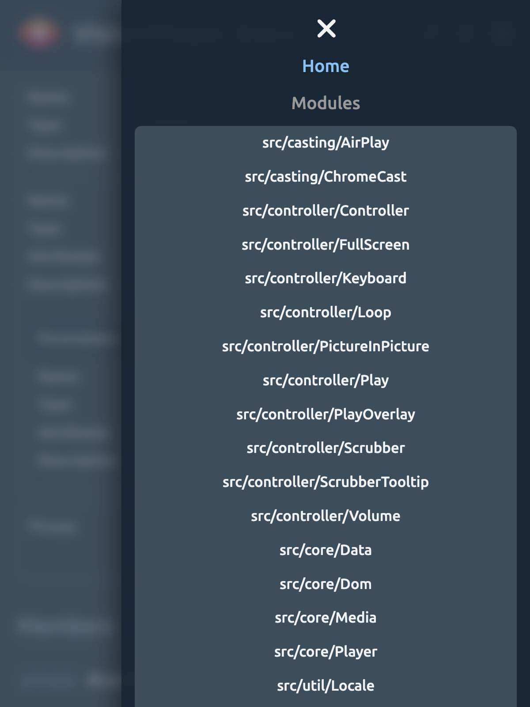 |
| :----------------------------------------------------------: | :----------------------------------------------------------: |

## Installation

This assumes you have Node.js, npm, and JSDoc already installed.

```bash
npm install --save-dev @alphanull/jsdoc-vision-theme
```

Add the theme to your `jsdoc.conf.json` template entry:

```json
{
    "opts": {
        "template": "@alphanull/jsdoc-vision-theme"
    }
}
```

Generate your docs:

```bash
npx jsdoc -c /path/to/jsdoc.conf.json
```

Or add a script to your `package.json`:

```json
"scripts": {
    "doc": "jsdoc --configure /path/to/jsdoc.conf.json"
}
```

And then run:

```bash
npm run doc
```

## Customization

This theme can be heavily customized using the `jsdoc.conf.json` file.  Based on JSDoc's default theme, it supports all [original theme options](https://jsdoc.app/about-configuring-jsdoc). Below is a comprehensive configuration example showcasing all additional VisionTheme features, available in the `"templates"` section of the config file.

### Full example config

```json
{
    "sourceType": "module",

    "source": {
        "include": ["./src/", "./lib/"]
    },

    "plugins": ["@alphanull/jsdoc-plugin-esnext", "plugins/markdown"],

    "tags": {
        "allowUnknownTags": true
    },

    "templates": {
        "title": "VisionPlayer Documentation",
        "description": "This is the official documentation for the VisionPlayer....",
        "canonical": "https://visionplayer.io/docs",
        "sort": false,
        "logoText": false,
        "logo": "./assets/svg/logo/VisionPlayerLogoDocs.svg",
        "logoDark": "./assets/svg/logo/VisionPlayerLogoDocsWhite.svg",
        "favicon": "./assets/svg/logo/favicon.svg",
        "css": "./scripts/docs/vision-player.css",
        "footer": "<p><b>VisionPlayer Version 1.0.0</b> ....</p>",
        "skin": "visionplayer",
        "skinLabel": "VisionPlayer Skin",
        "showFolded": true,
        "showPrivates": false,
        "showSkinSelector": true,
        "showFontSelector": true,
        "fontFamily": "ubuntu",
        "tutorialLabel": "Guide",
        "tutorialLabelPlural": "Guides",
        "tutorialHeader": false,
        "tutorialPageNav": false,
        "shortModuleLinkNames": true,
        "menuLinks": [
            {
                "label": "Microsite",
                "url": "https://visionplayer.io"
            },
            {
                "label": "GitHub",
                "url": "https://github.com/alphanull/visionplayer"
            }
        ]
    },

    "markdown": {
        "parser": "gfm",
        "hardwrap": false
    },

    "opts": {
        "template": "@alphanull/jsdoc-vision-theme",
        "destination": "./docs/jsdoc",
        "tutorials": "./docs",
        "readme": "./README.md",
        "recurse": true,
        "private": true
    }
}

```

### VisionTheme Options

Here are all options in detail. Many features are disabled by default to make the out-of-the-box experience familiar to the original theme. Enable and customize them to unlock the full power of VisionTheme:

| Option Name            | Default        | Description                                                                                                    |
|------------------------|---------------|----------------------------------------------------------------------------------------------------------------|
| `title`                | `''`          | Used as prefix for the document title.                                                                         |
| `description`          | `'This is the autogenerated JSDoc documentation.'` | Fallback text for meta descriptions. When set, it replaces the auto-generated description of the index page; other pages derive summaries from their content whenever possible. |
| `canonical`            | `''`          | Absolute URL prefix used to generate `<link rel="canonical">` tags. When set, all output pages resolve to `prefix + filename` (index defaults to the prefix itself). |
| `footer`               | `''`          | HTML snippet for the documentation footer (supports markup, links, copyright, etc.).                           |
| `sort`                 | `false`       | If `true`, sorts members alphabetically; if `false`, preserves code order.                                     |
| `folded`               | `false`       | If `true`, collapses all sections on page load for compact navigation.                                         |
| `showPrivates`         | `true`        | If `true`, shows private members in the documentation on page load. Only effective if private members are included using the [--private JSDoc option](https://jsdoc.app/about-commandline). |
| `logo`                 | `''`          | Path to logo (SVG/PNG). If the filepath is local, the file will be copied to the output.                       |
| `logoDark`             | `''`          | Path to additional logo for dark mode (SVG/PNG). If the filepath is local, the file will be copied to the output. |
| `logoText`             | `'Documentation'` | Show/hide project name as text next to the logo (`false` for logo-only header).                                |
| `showTitleOnHomepage`  | `true`        | Controls whether the page title is rendered as `<h1>` on the main page. Disable to avoid duplicate headings when your README already contains a top-level title. |
| `favicon`              | `''`          | Path to favicon. If the filepath is local, the file will be copied to the output.                              |
| `css`                  | `''`          | Path to custom CSS file to override/extend the default theme. If the filepath is local, the file will be copied to the output. |
| `js`                   | `''`          | Path to custom JS file to inject into the document header. If the filepath is local, the file will be copied to the output. |
| `skin`                 | `''`          | Predefined or user-defined color theme: `default`, `earth`, `ocean`, `forest`, `fire`, `desert`, `nordic`, `lavender`, `candy`, `mono`, or your own. |
| `skinLabel`            | `''`          | Custom label for a user-specified skin. If not provided and `skin` is not a predefined skin, a default label will be generated (e.g., "Custom Skin" for the skin "custom"). |
| `showSkinSelector`     | `true`        | If enabled, shows a skin selector in the options popup. Disable if you want to enforce a certain skin.         |
| `fontFamily`           | `'recursive'` | Font family for the theme.                                                                                      |
| `showFontSelector`     | `true`        | If enabled, shows a font selector in the options popup. Disable if you want to enforce a certain font.          |
| `tutorialLabel`        | `'Tutorial'`  | Custom label for tutorials (e.g., `"Guide"`).                                                                  |
| `tutorialLabelPlural`  | `'Tutorials'` | Plural label for tutorials (e.g., `"Guides"`).                                                                 |
| `tutorialHeader`       | `true`        | Show tutorial headers above each tutorial page (`true`/`false`).                                               |
| `tutorialPageNav`      | `false`       | Show navigation for tutorial pages above the page content.                                                     |
| `shortModuleLinkNames` | `false`       | If `true`, shortens module names in links.                                                                     |
| `outputSourceFiles`    | `false`       | If `true`, includes links to highlighted source code.                                                          |
| `staticFiles`          | `{}`          | Additional static files to copy into the output (images, fonts, SVGs, etc.).                                   |
| `menuLinks`            | `[]`          | Array of external links to add to the main navigation menu. Each link should have `label` and `url` properties. |


## Details

Here are more details about the theme's implementation and features:

### Layout optimizations

Great emphasis was placed on minimizing visual noise and clutter. This included reorganizing the layout by regrouping many attributes and parameters into a single definition list:

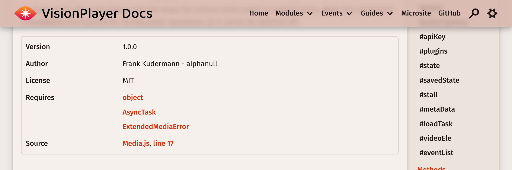

The theme also improves the rendering of modules that export a class by avoiding duplicate entries in Modules and Classes and by correctly displaying the constructor:

 ```javascript
 /**
  * Describes a class which is also a module
  * @exports module:myClass
  */
    export default class myClass {
 ```

 Another measure to reduce clutter is to shorten module names in links, since long module names can result in overly long link texts:

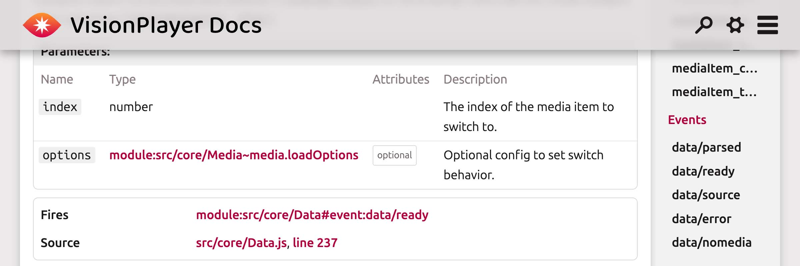

If you enable `shortModuleLinkNames` in the template config, link names are shortened (in a sensible way) to reduce clutter:

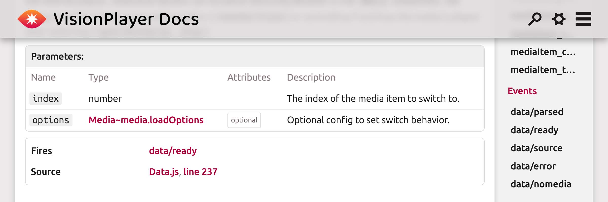

And last but not least, each section can be folded, either individually or by using the "Collapse / Expand All" buttons in the settings popup. You can also specify whether you want sections to be folded or unfolded on page load. This makes it much easier to navigate and maintain an overview of complex modules.

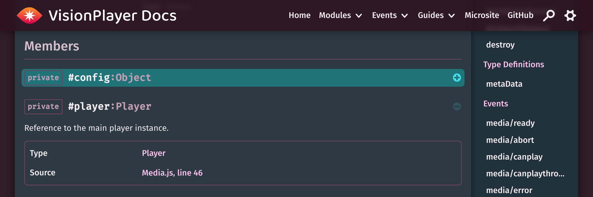

### Code Handling

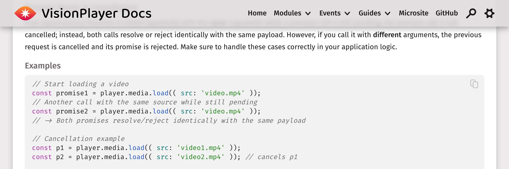

Great care was taken in handling the code view. First, this theme uses [Highlight.js](https://highlightjs.org/) for highlighting, which gives access to not only javascript code highlighting, but works with almost 200 languages out of the box. So you can also enrich your documentation with non-JS code. Works with both inline examples, code fences used in markdown files and of course the source code view.

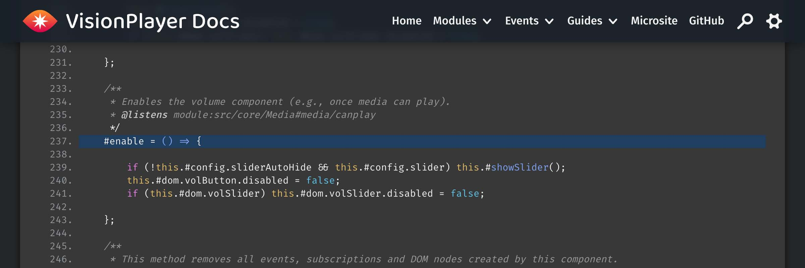

Line numbers and support for "jump to line" including highlighting the selected line are also supported, and each code block features a "Copy Code" button for easy copy & paste. Finally, all font sets include both monospaced and variable font variations from the same family for enhanced typographic fidelity – two of them even with code ligatures to make both coders and designers happy.

### Tutorials and Readme Tweaks

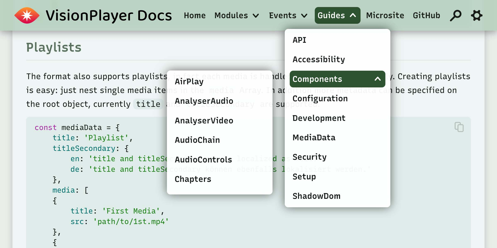

VisionTheme includes a number of tweaks to make tutorials and the Readme / Home page more usable:

- Tries to automatically link several tutorials and the home page together, so if you have a markdown link to another file, it will be preserved
- Likewise, any local links to images are preserved as well and in addition, the image file is copied to the /images folder
- As shown in the screenshot, if you define a [tutorial hierarchy](https://jsdoc.app/about-tutorials) the theme will automatically build a corresponding hierarchical dropdown menu.
- Also shown is the ability to rename  the menu header (and page headers), in this case to "Guide(s)"
- You can add additional links to the top navigation
- Last but not least, you can hide the in page tutorial nav (not needed to the dropdown menu) and the tutorial page header (if you have your own) in the jsdoc config (see below).

### Search & Settings

| 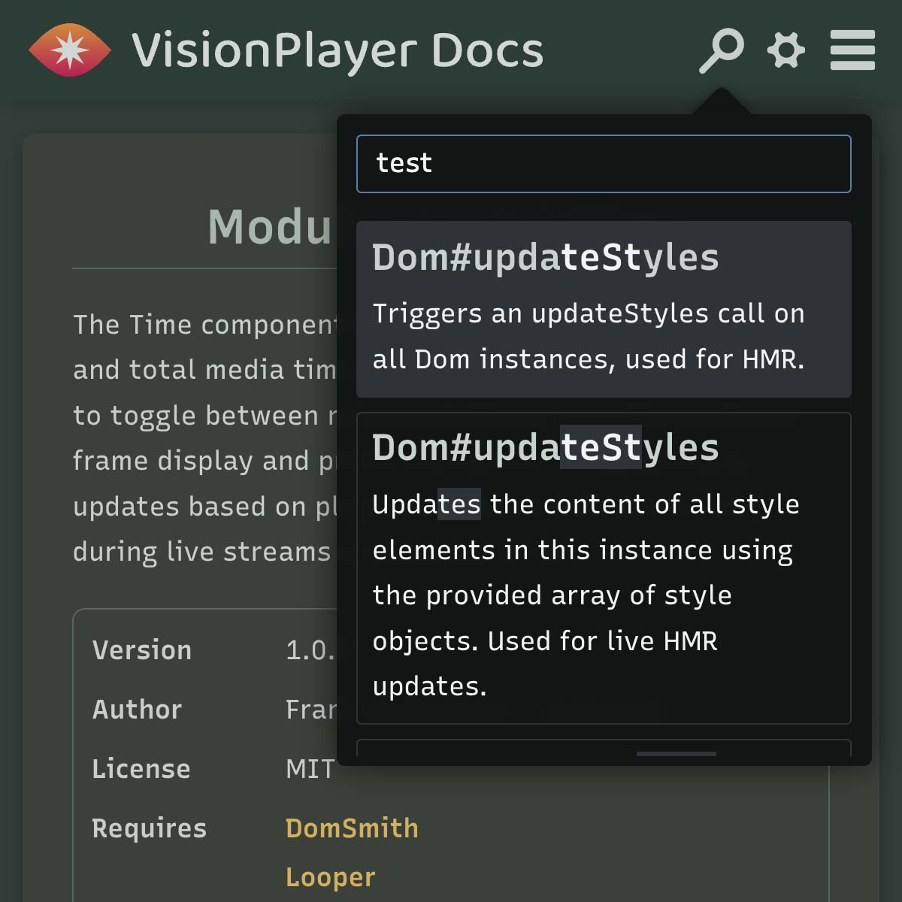 | 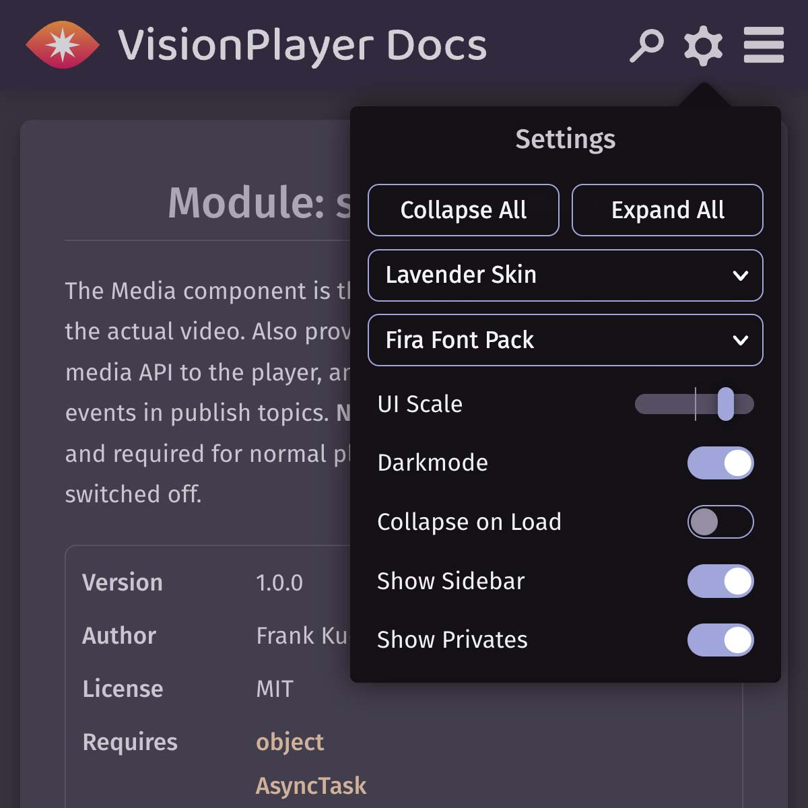 |
| :---------------------------------: | :--------------------------------------: |

Two powerful additions are the search and settings popup.

- In **settings**, you can change the look and feel of the theme, with settings persistent (using local storage) and re-applied on each page load. Select your favorite skin and font, or easily collapse or expand all sections & more.
- The theme also includes a performant **search**, using [Fuse.js](https://www.fusejs.io/) with fuzzy search and instant results as you type. This is done by indexing all doclets at compile time into an index.json file which resides in the /static folder in the output. When you click on the search icon, this file is lazy loaded and used for instant in memory searching (and it now falls back to an embedded index when you open docs via `file://`).

### Additional CSS & Branding

#### Define your own skin

VisionTheme automatically supports custom skins! When you specify a `skin` option that's not in the predefined list (e.g., `default`, `earth`, `ocean`, `forest`, `fire`, `desert`, `nordic`, `lavender`, `candy`, `mono`), it will be automatically added to the skin selector with a custom label. You can control this label using the `skinLabel` option.

**Example:**

```json
"templates": {
    "skin": "myskin",
    "skinLabel": "My Skin",
    "css": "/path/to/myskin.css"
}
```

This will add "My Skin" to the skin selector dropdown. If no `skinLabel` is provided, a default label will be generated. Here is what `myskin.css` could look like:

```css
:root[data-skin=myskin] {
    --color-neutral-hue: 339;
    --color-neutral-saturation: 10%;
    --color-1st-hue: 339;
    --color-1st-saturation: 100%;
    --color-1st-lightness: 40%;
    --color-2nd-hue: 211;
    --color-2nd-saturation: 100%;
    --color-2nd-lightness: 40%;
}

/* To tweak the dark mode settings, use the following format: */
@media only screen {
    :root.is-dark-mode[data-skin=myskin] {
        --color-neutral-hue: 211;
    }
}
```

You can add more settings, but if it's only about the colors, this should be enough for most cases. VisionTheme uses an HSL color-based scheme instead of traditional RGB (see also [W3Schools HSL](https://www.w3schools.com/css/css_colors_hsl.asp)). This allows for a uniform color scheme with lightness and saturation variations using fewer variables, and the dark mode CSS can be calculated almost automatically, making it much easier to maintain.

Instead of specifying color values directly, you specify hue, saturation, and lightness separately. Here are the 4 main color variables used in the design:

- `--color-neutral-xxx` – used for page and header backgrounds
- `--color-1st-xxx` – used for links
- `--color-2nd-xxx` – used for form controls & inputs
- `--color-3rd-xxx` – used for page background, defaults to `--color-neutral`

#### Additional CSS Variables

Besides colors, there are many more styles specified using CSS variables found in `/assets/scss/vars.scss` in the theme source code. Use those to tweak your skin even more. There are over 100 variables to use; here are some examples:

- `--spacing-block`  – Spacing between layout blocks
- `--spacing-block-small`  – Default spacing used within layout blocks
- `--page-width-max` – Max width of the page layout
- `--border-radius` – Border radius used for boxes, drop-downs, etc.
- `--border-radius-small` – Used for smaller elements like buttons or inputs

For more, just look into the source or inspect the variables defined on the root element in your browser. While those are not documented, they should be pretty self-explanatory. If you need more insights regarding variables or the VisionTheme CSS in general, please let me know.

## Browser Support

The VisionTheme frontend supports all major browsers on all platforms (i.e. macOS, iOS, Windows, Android & Linux) released since ~2019-2020 and later, including Chrome (v79+), Firefox (v75+) and Safari (v13+).

## Contributing

Contributions, issues, and feature requests are welcome! Feel free to check the [issues page](https://github.com/alphanull/jsdoc-vision-theme/issues) or submit a pull request. For major changes, please open an issue first to discuss what you would like to change.

### Need help or want a custom solution?

I also offer customization services for this theme (and more). If you have special requirements or prefer not to customize the theme yourself, just contact me and I'll be happy to help!

## License

[Apache 2.0](https://opensource.org/license/apache-2-0) (Original theme & modifications)

[MIT License](https://opensource.org/license/MIT) (own additions)

Copyright © 2025–present Frank Kudermann @ [alphanull.de](https://alphanull.de)
